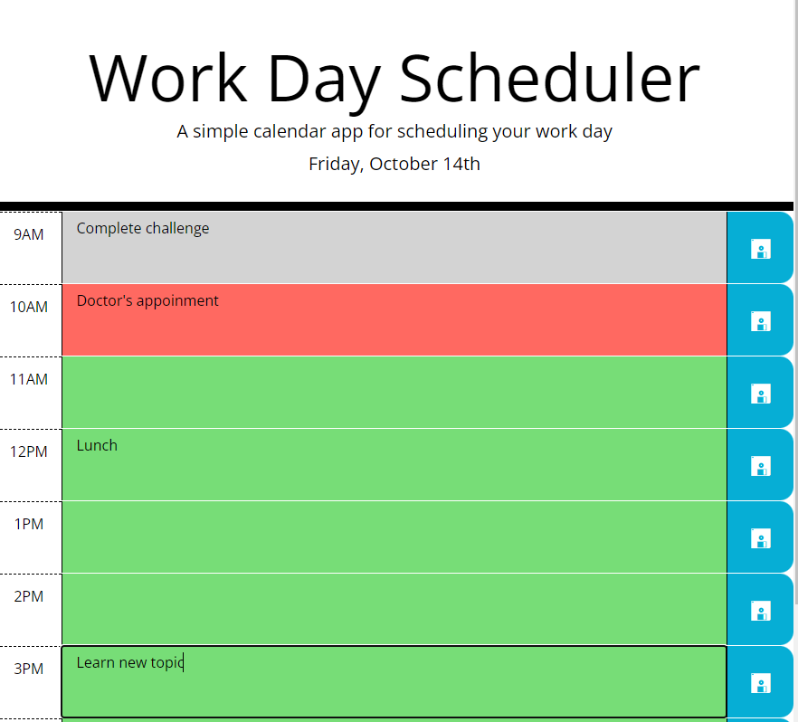
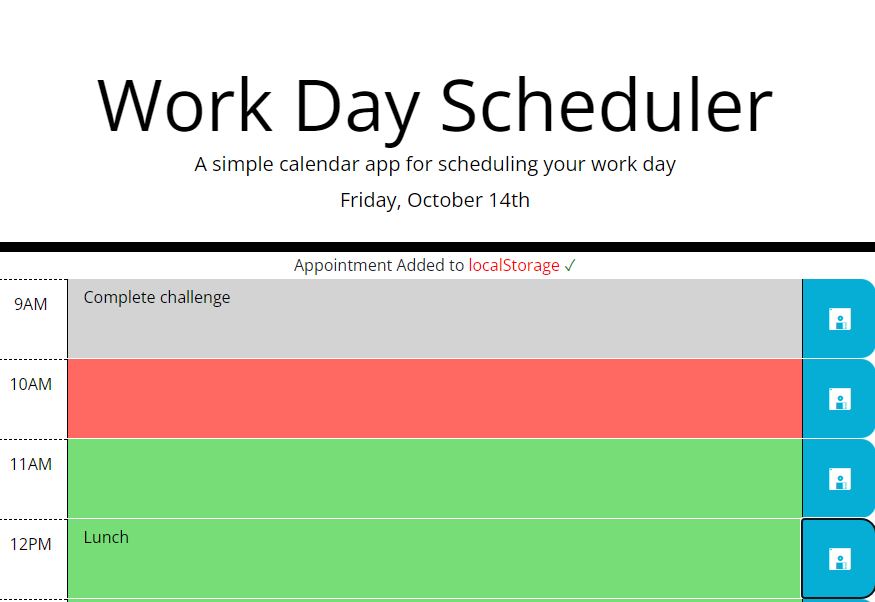

# Work Day Scheduler Starter Code
## Description
This is a simple calendar application which allow a user to save events for each hour of the working day. Assumed working day: 9AM - 6PM.

Tech. stack:
- HTML
- CSS
- JavaScript
- Bootstrap
- jQuery
- Day.js, dayjs plugin: advancedFormat

Saved events are stored in browser's localStorage

## Usage
This site was built using [GitHub Pages](https://pages.github.com/). 

Available by link https://olgagav.github.io/work-day-scheduler/

Application present the time table for today where you can add / edit / save events for corresponding time slot. 

Click on corresponding text area, add / edit / delete text and click on blue **Save** button. Text is not saved auomatically.

_Note_: Event records are stored in user browser's localStorage.

When user save event notification "Appointment Added to localStorage ✓" is displayed for 2 seconds.

The current time event is highlighed by **red** color background.
All future event you may see on **green** background.
All past events are **grey**.

## Credits

Learning materials [Berkley Extension: coding bootcamp](https://extension.berkeley.edu/)

## License
MIT
